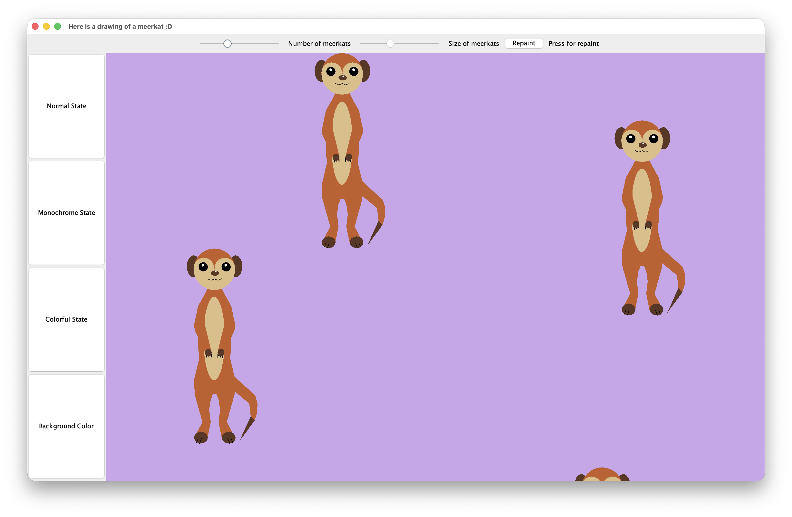

# Meerkat Drawing (Java)

A Java object-oriented programming project developed as part of a university Object-Oriented Programming (OOP) lab.

The goal of the assignment was to design and implement a graphical application that renders an animal using object-oriented design principles. For this project, I chose to model and draw a **meerkat**, with each body part represented as an independent class.

---

## Preview



---

## Features

- Draws one or multiple meerkats using Java Graphics
- Object-oriented class design with reusable components
- Individual classes for each body part
- Randomized meerkat generation within a scene
- Multiple rendering modes using the State Pattern
- Adjustable drawing parameters through the user interface

---

## Object-Oriented Concepts Practiced

- Inheritance
- Composition
- Interfaces
- State Design Pattern
- Encapsulation
- Java Swing Graphics

---

## Technologies

- Java
- Swing
- AWT

---

## Project Structure

```
src/
└── meerkatDrawing/
    ├── Arm.java
    ├── Belly.java
    ├── Body.java
    ├── Drawing.java
    ├── DrawingArea.java
    ├── Ear.java
    ├── Eye.java
    ├── Head.java
    ├── Leg.java
    ├── LocatedRectangle.java
    ├── Meerkat.java
    ├── MeerkatDrawing.java
    ├── Mouth.java
    ├── Nose.java
    ├── RandomNumber.java
    ├── Scene.java
    ├── SouthernAfricanAnimal.java
    ├── Tail.java
    ├── TestDrawingTool.java
    └── graphicState/
```

---

## Learning Outcomes

Through this project I practiced:

- Designing software using object-oriented principles
- Breaking a complex object into reusable components
- Applying inheritance and composition effectively
- Organizing Java projects into maintainable classes
- Building a graphical desktop application with Java Swing

---

## License

This project is available under the MIT License.